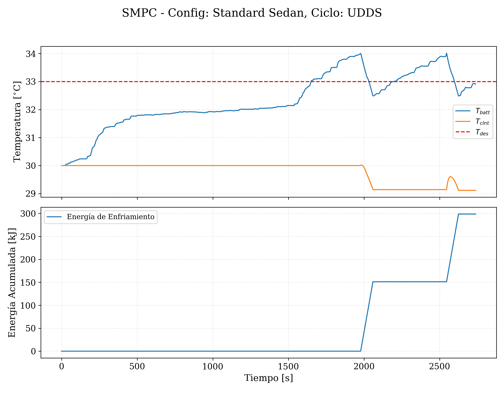
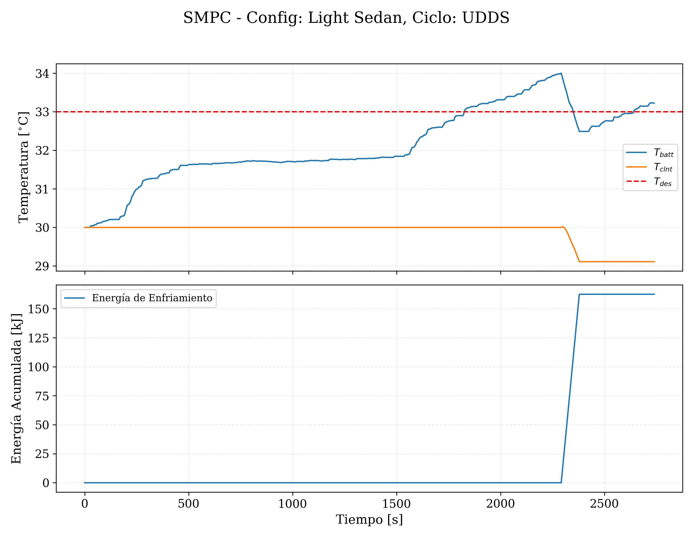
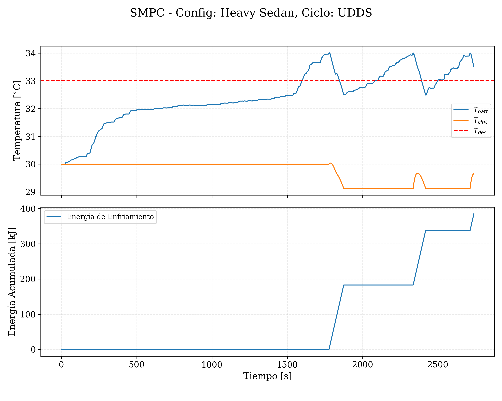

# Virtual-Test-for-Automotive-Battery-Thermal-Management-System-BTMS-
Parametric simulation environment using standard automotive drive cycles (UDDS, LA92, HWFET), based on the same SMPC controller.

# Project Title

## Results

*Figure 1: Desired temperature and current temperature of the battery along the driving.*
### For 1700 and 2000 kg respectively:
| Plot 1 | Plot 2 |
|--------|--------|
|  |  |